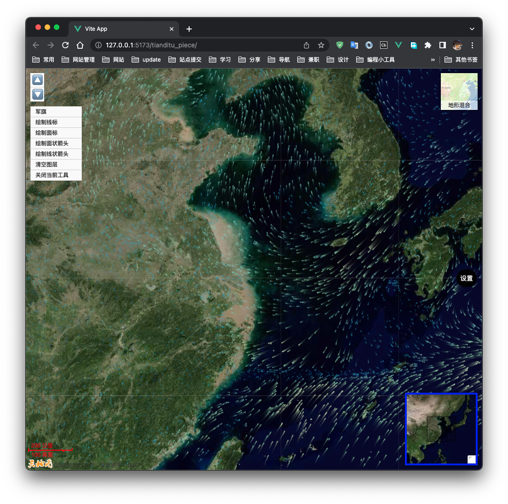

# tmap-wind

Tmap-wind是天地图api4.0（天地图是什么？这里查看：[天地图](http://lbs.tianditu.gov.cn/api/js4.0/guide.html)）canvas风场可视化/风向图的插件，粒子效果基于[wind-core](https://github.com/sakitam-fdd/wind-layer/tree/master/packages/core)做的封装，插件内置一个优化后的配置项，提高了展示性能，在使用时可以只填入数据，不需要手动配置，即可生成风向图。

# 效果图



# 安装

```shell
npm install tmap-wind -S
```

# 在线示例

在线示例为vue2环境，如果地图加载不出来，说明配额用完了，不影响展示风场

[](https://codesandbox.io/s/tmap-wind-demo-556o88?autoresize=1&fontsize=14&hidenavigation=1&theme=dark)

# 使用教程

- 这里以vite3和vue3组合式语法代码为例

最简单的方式，引入组件后直接使用，无需配置

```js
import("tmap-wind").then(({ WindLayer }) => {
  fetch(
    "https://sakitam.oss-cn-beijing.aliyuncs.com/codepen/wind-layer/json/wind.json"
  )
    .then((res) => res.json())
    .then((res) => {
      const pdefinedOverlay = new WindLayer(res);
      console.log(pdefinedOverlay);
     	// 将视图使用addOverLay(pdefinedOverlay)的方式放入地图即可
			map.addOverLay(pdefinedOverlay)
     	············
    });
});
```

## 更新数据

当使用`new WindLayer()`后，生成的视图对象包含了各种方法，其中有`setData()`，详细见下面的示例。

```js
      import("tmap-wind").then(({ WindLayer }) => {
        fetch(
          "https://sakitam.oss-cn-beijing.aliyuncs.com/codepen/wind-layer/json/wind.json"
        )
          .then((res) => res.json())
          .then((res) => {
            const pdefinedOverlay = new WindLayer([]);
            
            // 记得使用addOverLay，将图层放入地图
            // 例如map.addOverLay(pdefinedOverlay);
						map.addOverLay(pdefinedOverlay)
						
            setTimeout(() => {
            	// 模拟数据更新的情况，一开始生成没有任何数据，一段时间后才会显示数据
              pdefinedOverlay.setData(res)
            }, 5000)
          });
      });
```

## 删除视图/销毁视图

参考上方的变量`pdefinedOverlay`

```js
map.removeOverLay(pdefinedOverlay)
```

## 隐藏/显示

```js
// 隐藏
pdefinedOverlay.hide()
// 显示
pdefinedOverlay.show()
```

# 配置项

配置项包含两部分，一个是插件配置项，一个是WindCore的粒子效果配置项，下方展示了所有配置项的集合。

```js
            const pdefinedOverlay = new WindLayer([], {
              // 指定canvas图层层级
              zIndex: 999,
              // 是否使用自定义的样式，使用后zIndex配置将失效，请自行设置zIndex
              customStyle: "",
              // 默认为false，是否禁止使用插件的默认配置项，如果为true，请自行指定windOptions的配置项，
              // 配置项参数详见下方：WindCore
              isDisableAutoConfig: true,
              // 以下为WindCore的配置项
              windOptions: {
                velocityScale: 1 / 20,
                paths: 5000,
                // eslint-disable-next-line no-unused-vars
                colorScale: [
                  "rgb(36,104, 180)",
                  "rgb(60,157, 194)",
                  "rgb(128,205,193 )",
                  "rgb(151,218,168 )",
                  "rgb(198,231,181)",
                  "rgb(238,247,217)",
                  "rgb(255,238,159)",
                  "rgb(252,217,125)",
                  "rgb(255,182,100)",
                  "rgb(252,150,75)",
                  "rgb(250,112,52)",
                  "rgb(245,64,32)",
                  "rgb(237,45,28)",
                  "rgb(220,24,32)",
                  "rgb(180,0,35)",
                ],
                lineWidth: 2
              },
            });
```


## `tmap-wind`

| 参数                  | 说明                                                         | 类型      | 默认值                                                       |
| --------------------- | ------------------------------------------------------------ | --------- | ------------------------------------------------------------ |
| `zIndex`              | 指定canvas图层层级                                           | `number`  | `无`                                                         |
| `customStyle`         | 是否使用自定义的样式，使用后zIndex配置将失效，请自行设置zIndex | `string`  | `position:absolute; left:0; top:0; z-index: ${this.zIndex} ;user-select:none;` |
| `isDisableAutoConfig` | 是否禁止使用插件的默认配置项                                 | `boolean` | `false`，如果为true，请自行指定windOptions的配置项           |
| `windOptions`         | WindCore的配置项                                             | `Object`  | 无                                                           |

## `WindCore`

| 参数                               | 说明                                                     | 类型                       | 默认值                                                       |
| ---------------------------------- | -------------------------------------------------------- | -------------------------- | ------------------------------------------------------------ |
| `globalAlpha`                      | 全局透明度，主要影响粒子路径拖尾效果                     | `number`                   | `0.9`                                                        |
| `lineWidth`                        | 粒子路径宽度                                             | `number|function`          | `1`, 当为回调函数时，参数`function(m:对应点风速值) => number` |
| `colorScale`                       | 粒子颜色配置                                             | `string|function|string[]` | `#fff`，当为回调函数时，参数`function(m:对应点风速值) => string` |
| `minVelocity`                      | 粒子最小风速                                             | `number`                   | 配置此值主要影响当`colorScale`为颜色数组时的颜色索引，非必填 |
| `maxVelocity`                      | 粒子最大风速                                             | `number`                   | 配置此值主要影响当`colorScale`为颜色数组时的颜色索引，必填   |
| `velocityScale`                    | 对于粒子路径步长的乘积基数                               | `number`                   | `1 / 25`                                                     |
| `maxAge | particleAge(不推荐使用)` | 粒子路径能够生成的最大帧数                               | `number`                   | `90`                                                         |
| `paths`                            | 生成的粒子路径数量                                       | `number|function`          | `800`, 当为回调函数时，参数`function(m:对应点风速值) => number` |
| `particleMultiplier`               | 粒子路径数量的系数，不推荐使用（视野宽度 * 高度 * 系数） | `number`                   | `1 / 300`                                                    |
| `frameRate`                        | 帧率（ms）                                               | `number`                   | `20`                                                         |

# 鸣谢

https://github.com/sakitam-fdd/wind-layer

# 其他

博客：[随机的布尔值](https://bingyishow.top/)

# 赞助

[赞助一杯咖啡](https://bingyishow.top/11.html)
